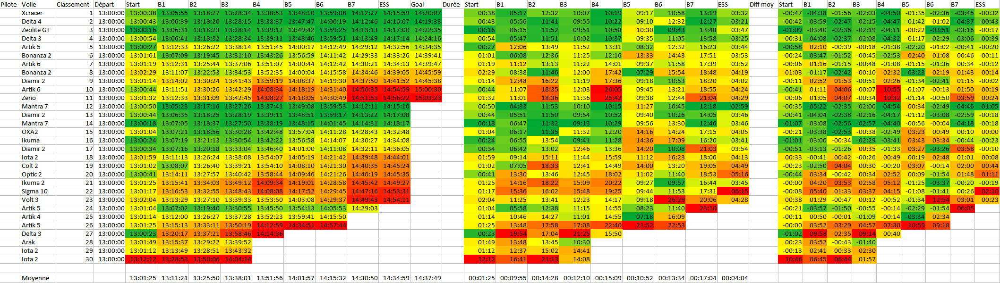

# Paraglide Compet Analytics

## Description

Cet outils permet d'automatiser l'extraction d'information depuis les trace GPS de pilotes durant une compétition. Il permet de récupérer pour chaque compétiteurs, les horaires de passage des balises et d'extraire le tout au format XLS.

## Rendu
Une fois, les données traitées dans une feuille de calcul voici le rendu final:

Cet exemple de feuille de calcul est disponible à [`./calc/rendu.xls`](calc/rendu.xls).

[!WARNING] Une fois le rendu généré via le script, il est possible que votre logiciel de tableur (Libre OfficeCalc par exemple) ne calcule pas automatiquement le résultat des formules. Il faut donc demander le calcul manuel: Data > Calculate > Recalculate Hard (Ctrl + Shift + F9).

## Entrées

### Task

L'outils prend en entrée le descriptif de la manche au format FSTask. Le site [vololiberomontecucco.it](http://www.vololiberomontecucco.it/taskcreator/) permet de générer le descriptif de la manche et de l'exporter.

### Traces GPS

#### Méthode simple

Les traces GPS des pilotes doivent être au format IGC. Il est possible de les récupérer sur le [site de la  FFVL](https://parapente.ffvl.fr) à la page de chaque compétition.

Cette méthode à l'avantage d'être simple mais ne permet pas de récupérer les traces de tous les pilotes.

#### Avec le logiciel Cargol

Il est possible de récupérer le projet Cargol de la compétition sur le [site de la  FFVL](https://parapente.ffvl.fr) à la page de chaque compétition.

Ensuite avec le logiciel [Cargol](https://parapente.ffvl.fr/telecharger-cargol), il faut charger le fichier .cpt contenu dans le zip. Selectionnez "Pointage & Traces"

Puis "Exporter" > "Toutes les traces en IGC"

Les traces se trouvent, en partant du dossier contenant le fichier .cpt: `<dossierAuNomDuCpt>/Export/Manche X/`.
